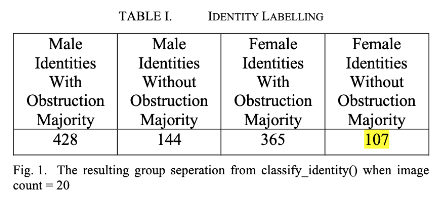

# How Gender Attributes Play a Role in User Identification

> Facial-recognition authentication study using **CelebA**, **facial-landmark features**, **SVM + KNN score-level fusion**, and subgroup analysis across gender-associated facial attributes.

**Authors:** Joshua-Luke Lacsamana, Amber Nguyen, Anosh Askari  
**Institution:** University of South Florida  
**Report Source:** `source.pdf`

---

## Project Summary
This project investigates whether **gender** and **gender-associated facial attributes** affect the accuracy of a facial-recognition authentication system. The system uses facial landmarks from the **CelebA** dataset, converts landmark relationships into feature vectors, trains **Support Vector Machine (SVM)** and **K-Nearest Neighbors (KNN)** classifiers, and combines their outputs using **score-level fusion**.

The central questions were:
- Does facial-recognition accuracy differ between male and female identities?
- Do gender-associated attributes such as **facial hair**, **heavy makeup**, and **lipstick** meaningfully affect authentication performance?

---

## Why This Project Matters
Facial recognition is widely used in authentication and identity verification, but its performance can vary across demographic groups. This project explores whether observed performance differences are tied to **gender itself** or to **associated visual attributes** that may change how distinguishable a face appears to a classifier.

---

## Dataset
The study uses the **CelebA** dataset, which includes:
- **10,177 identities**
- **202,599 aligned face images**
- **5 facial landmark locations** per image
- **40 binary facial attributes** per image

### Features Used
**Landmark coordinates**
- left eye `(x, y)`
- right eye `(x, y)`
- nose `(x, y)`
- left mouth `(x, y)`
- right mouth `(x, y)`

**Gender-associated attributes**
- heavy makeup
- lipstick
- gender
- mustache
- beard
- goatee
- 5 o'clock shadow

---

## Approach
### 1. Data consolidation
The original CelebA attribute, identity, and landmark annotations were merged into a unified label file for easier filtering and processing.

### 2. Balanced subset construction
To reduce class imbalance and identity bias, the dataset was filtered so that:
- each identity had the same number of images,
- male and female identities were balanced,
- obstruction and non-obstruction subgroups were approximately balanced.

The final filtered set contained **428 identities**:
- **214 male identities**
- **214 female identities**

### 3. Majority obstruction labeling
Each identity was labeled by majority vote as an **obstruction** or **non-obstruction** case based on its dominant attribute pattern.

Examples:
- men: facial hair vs. no facial hair
- women: heavy makeup / lipstick vs. no makeup / lipstick

### 4. Feature engineering
The system computed **Euclidean distances between all unique landmark pairs** to build a compact geometric feature representation for each image.

### 5. Classification pipeline
Two classifiers were trained:
- **Support Vector Machine (SVM)**
- **K-Nearest Neighbors (KNN)**

Their probabilities were combined using **score-level fusion**, and the resulting authentication behavior was evaluated using:
- **accuracy**
- **ROC curves**
- **DET curves**

---

## Experimental Snapshot
The original report’s identity-labeling table and grouped accuracy results are shown below.

---

## Results
### Accuracy by subgroup
| Group | Condition | Accuracy |
|---|---|---:|
| Male | All obstructions included | 0.76 |
| Female | All obstructions included | 0.73 |
| Male | Facial hair | 0.75 |
| Male | No facial hair | 0.74 |
| Female | Heavy makeup and lipstick | 0.74 |
| Female | No makeup or lipstick | 0.71 |

### Key findings
- **Male identities** achieved slightly higher authentication accuracy than **female identities** overall.
- The difference was about **3 percentage points**, which aligns with prior literature referenced in the report.
- For male identities, **facial hair** slightly improved performance relative to no facial hair.
- For female identities, **heavy makeup / lipstick** slightly improved performance relative to the no-makeup subset.
- The **women-without-makeup** subgroup showed the weakest performance.
- The overall differences were **modest**, so the report avoids claiming that gender-associated obstructions alone fully explain the performance gap.

---

## Visual Results
### Men vs. women ROC / DET behavior

### Men with facial hair vs. no facial hair

### Women with heavy makeup vs. no makeup

---

## Interpretation
The fused **SVM + KNN** system achieved roughly **75% overall accuracy**. The curve analysis suggests:
- the authentication pipeline was functioning meaningfully,
- male identities were slightly easier to distinguish in this setup,
- female identities showed more overlap between genuine and imposter scores,
- so-called “obstructions” were not necessarily harmful and in some cases may have increased inter-identity separation.

One of the most interesting findings was that some gender-associated attributes that might be assumed to reduce performance actually corresponded with **slightly better results**. The report suggests this may be because those attributes can make identities more visually distinct.

---

## Ethics Considerations
The report includes a dedicated ethics section emphasizing three risk areas.

### Privacy and security
Facial recognition relies on sensitive biometric data, so misuse or poor handling can create privacy and security risks.

### Societal harms
Biased or poorly designed facial-recognition systems can contribute to inequitable treatment, including demographic bias and harmful surveillance use cases.

### Risk mitigation
The report recommends:
- regular bias audits,
- more diverse and representative datasets,
- fairness, transparency, and accountability practices,
- strong data protection and secure storage,
- clearer governance for biometric systems.

---

## Technical Skills Demonstrated
- biometric authentication analysis
- dataset filtering and balancing
- landmark-based feature engineering
- SVM classification
- KNN classification
- score-level fusion
- ROC / DET evaluation
- experimental comparison across demographic subgroups
- ethics-aware analysis of AI systems

---

## Repository Contents
- `README.md` — project-style summary of the report
- `source.pdf` — original final report
- `images/` — extracted figures from the PDF

---

## Notes
This README is a project-style conversion of the original PDF report. For complete methodology details, discussion, and references, see **`source.pdf`**.
